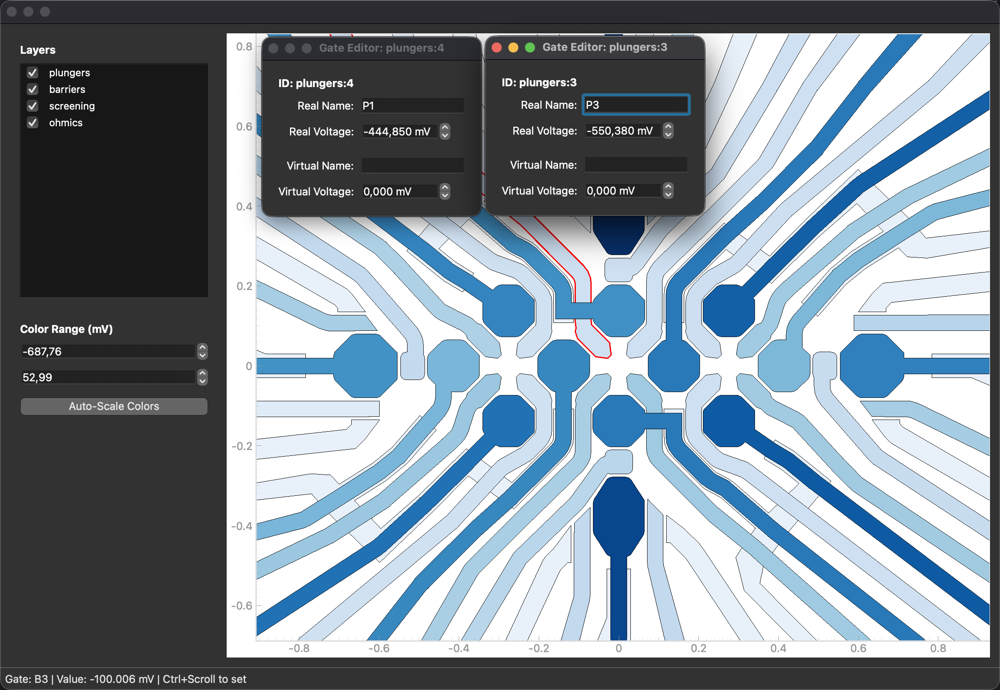

# GDS Parameter Viewer

[](https://www.gnu.org/licenses/gpl-3.0)
[](https://www.python.org/)


Interactive GDS viewer for quantum dot device gate layouts. Renders GDS files using PyQtGraph, maps GDS layers to QCodes `Parameter` objects, and supports real-time voltage control via scroll or manual input. Shapes on the same layer that touch are merged automatically.



## Features

- **GDS rendering** — loads and renders GDS files with per-layer colour coding using a matplotlib colormap
- **QCodes integration** — maps GDS shapes to real and virtual `Parameter` objects; gate colours reflect live voltage values
- **Hardware polling** — reads gate voltages from hardware at 200ms intervals (5 Hz) and updates colours in real time
- **Scroll to set** — hover over a gate and use Ctrl+Scroll to increment/decrement its voltage in 1 mV steps
- **Click to edit** — click any gate to open a dedicated editor window for manual voltage entry and parameter remapping
- **Layer toggling** — show/hide individual layers via checkboxes in the sidebar; drag to reorder z-order
- **Color range control** — manually set voltage min/max for the colormap, or use Auto-Scale to fit current values
- **Shape merging** — touching polygons on the same GDS layer are automatically merged into a single gate shape
- **IPython/PyCharm support** — detects interactive shells and configures the Qt event loop automatically

The device shown is from:

> John, V., Yu, C.X., van Straaten, B. et al. Robust and localised control of a 10-spin qubit array in germanium. *Nat Commun* **16**, 10560 (2025). https://doi.org/10.1038/s41467-025-65577-3

## Installation

```bash
pip install git+https://github.com/b-vanstraaten/GDS_Parameter_Viewer.git
```

With optional QuTech dependencies (core-tools, sqdl-client):

```bash
pip install "GDS-Parameter-Viewer[qutech] @ git+https://github.com/b-vanstraaten/GDS_Parameter_Viewer.git"
```

> **Linux:** requires a display server (X11 or Wayland). On headless systems set `DISPLAY=:0` or use a virtual framebuffer (`Xvfb`).

## Quick start

```python
from pathlib import Path
from qcodes import Parameter
from GDS_Parameter_Viewer.GDSViewer import GDSViewer

GDS_PATH = Path("example_gds/simple_device.gds")


class Gates:
    # Physical gates
    P1: Parameter = make_gate("P1")
    P2: Parameter = make_gate("P2")
    B12: Parameter = make_gate("B12")
    # Virtual gates
    vP1: Parameter = make_gate("vP1")
    vP2: Parameter = make_gate("vP2")
    vB12: Parameter = make_gate("vB12")


mapping = {
    "barriers": {
        "layers": [0],
        "real_gates": {0: "B12"},
        "virtual_gates": {0: "vB12"},
    },
    "plungers": {
        "layers": [1],
        "real_gates": {0: "P1", 1: "P2"},
        "virtual_gates": {0: "vP1", 1: "vP2"},
    },
}

gates = Gates()
viewer = GDSViewer(GDS_PATH, gates=gates, mapping=mapping)

# Set a gate voltage programmatically
gates.B12(-500)
```

## Keyboard shortcuts

| Action | Shortcut |
|--------|----------|
| Adjust gate voltage | Hover over gate + `Ctrl+Scroll` |
| Open gate editor | Click gate |
| Pan view | Click and drag |
| Zoom | Scroll |
| Reset view | Double-click background |

## Mapping structure

The `mapping` dict groups GDS layers into named gate groups:

```python
mapping = {
    "<group_name>": {
        "layers": [<layer_number>, ...],   # GDS layer numbers to include; touching shapes are merged
        "real_gates": {<shape_index>: "<gate_name>", ...},    # physical gate parameters
        "virtual_gates": {<shape_index>: "<gate_name>", ...}, # virtual gate parameters
    },
}
```

- **`layers`** — list of GDS layer numbers. All shapes across these layers are loaded; shapes that touch are merged into a single polygon.
- **`real_gates`** — maps shape index (after merging) to a physical QCodes `Parameter` name on the `gates` object.
- **`virtual_gates`** — same, but for virtual gate parameters.

Shape indices are assigned in the order shapes appear after merging, starting at 0.

## Author

Barnaby van Straaten (QuTech, Delft University of Technology)

## License

GPL-3.0-or-later. See [LICENSE](LICENSE).
